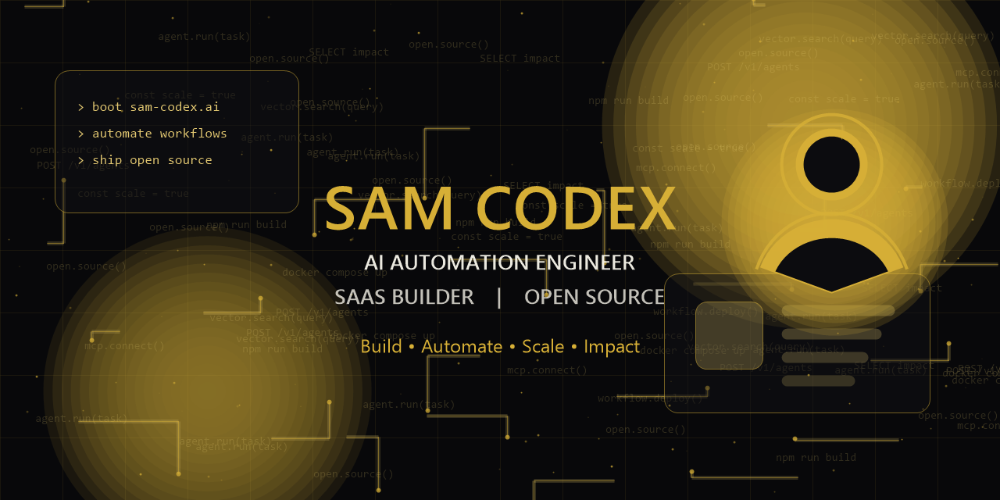
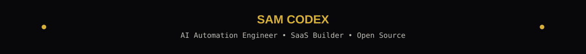
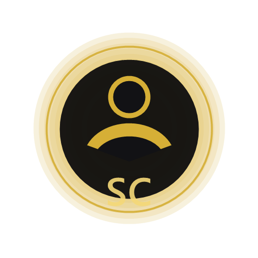
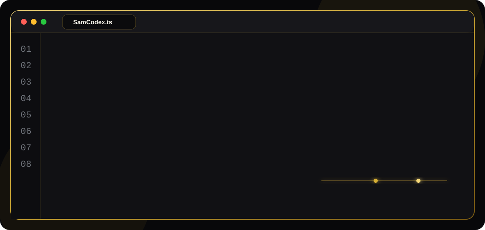
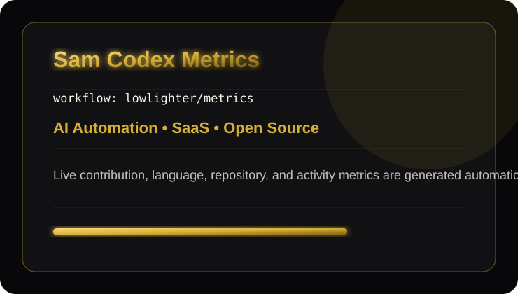
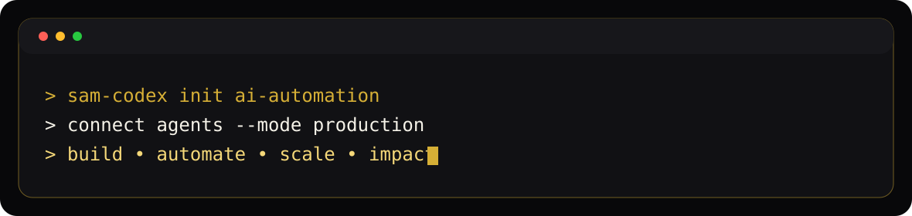
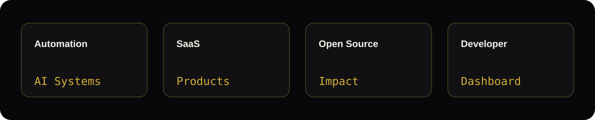
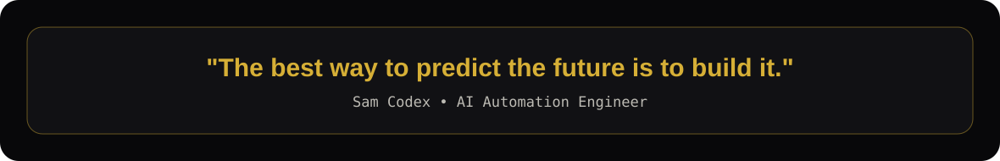

<!--
Sam Codex GitHub Profile
Keywords: Sam Codex, AI Automation Engineer, SaaS Builder, Open Source Contributor, AI developer dashboard, automation engineer, full stack developer, personal IDE, open source.
-->

  
   
  

 

  

  <h1>Sam Codex</h1>
  <h3>AI Automation Engineer | SaaS Builder | Open Source Contributor</h3>

  

   
   

  
  
  
  
  

   
   

  
  
  

 

  

## Developer Dashboard

<table>
  <tr>
    <td width="33%" align="center">
      <strong>AI Automation</strong>
       
      Agents, workflows, RAG systems, and production automation.
    </td>
    <td width="33%" align="center">
      <strong>SaaS Builder</strong>
       
      Fast product loops, clean architecture, and scalable platforms.
    </td>
    <td width="33%" align="center">
      <strong>Open Source</strong>
       
      Useful tools, practical systems, and developer-first engineering.
    </td>
  </tr>
</table>

## About Me

  

## Tech Stack

<table>
  <tr>
    <td align="center" width="16.6%"> <strong>React</strong></td>
    <td align="center" width="16.6%"> <strong>Next.js</strong></td>
    <td align="center" width="16.6%"> <strong>Node.js</strong></td>
    <td align="center" width="16.6%"> <strong>JavaScript</strong></td>
    <td align="center" width="16.6%"> <strong>TypeScript</strong></td>
    <td align="center" width="16.6%"> <strong>Python</strong></td>
  </tr>
  <tr>
    <td align="center"> <strong>FastAPI</strong></td>
    <td align="center"> <strong>Docker</strong></td>
    <td align="center"> <strong>PostgreSQL</strong></td>
    <td align="center"> <strong>MongoDB</strong></td>
    <td align="center"> <strong>Redis</strong></td>
    <td align="center"> <strong>Linux</strong></td>
  </tr>
  <tr>
    <td align="center"> <strong>AWS</strong></td>
    <td align="center"> <strong>Azure</strong></td>
    <td align="center"> <strong>Git</strong></td>
    <td align="center"> <strong>GitHub</strong></td>
    <td align="center"> <strong>VS Code</strong></td>
    <td align="center"> <strong>MCP</strong></td>
  </tr>
</table>

  
  
  
  
  
  

 

  

## Current Projects

<table>
  <tr>
    <td width="50%">
      <h3>Password Manager</h3>
      
Encrypted credential vault for individuals and teams with secure sharing, access control, and audit-ready workflows.

      

      

      
<code>Next.js</code> <code>TypeScript</code> <code>PostgreSQL</code> <code>Docker</code>

      
    </td>
    <td width="50%">
      <h3>Couples Space</h3>
      
Private shared space for plans, memories, reminders, notes, and AI-assisted relationship workflows.

      

      

      
<code>React</code> <code>Node.js</code> <code>MongoDB</code> <code>OpenAI</code>

      
    </td>
  </tr>
  <tr>
    <td width="50%">
      <h3>Once One Chat</h3>
      
Unified messaging layer for contextual conversations, smart routing, and AI-assisted response orchestration.

      

      

      
<code>FastAPI</code> <code>Redis</code> <code>WebSockets</code> <code>Claude</code>

      
    </td>
    <td width="50%">
      <h3>Ultimate RAG Agent</h3>
      
Production RAG platform with ingestion pipelines, vector search, observability, model routing, and agent tools.

      

      

      
<code>Python</code> <code>Qdrant</code> <code>PostgreSQL</code> <code>MCP</code>

      
    </td>
  </tr>
  <tr>
    <td colspan="2">
      <h3>Personal IDE</h3>
      
AI-native development cockpit for planning, coding, automation, memory, execution traces, and agentic workflows.

      

      

      
<code>Electron</code> <code>TypeScript</code> <code>Ollama</code> <code>OpenAI</code> <code>GitHub</code>

      
    </td>
  </tr>
</table>

## GitHub Dashboard

  
  
  
  

 

  
  

  
  

  

  

<!-- GITHUB-STATS-SUMMARY:START -->
<table>
  <tr>
    <td width="25%" align="center"><strong>9</strong> Public Repositories</td>
    <td width="25%" align="center"><strong>0</strong> Followers</td>
    <td width="25%" align="center"><strong>3</strong> Total Stars</td>
    <td width="25%" align="center"><strong>2026-07-15 11:40 UTC</strong> Last Sync</td>
  </tr>
</table>
<!-- GITHUB-STATS-SUMMARY:END -->

## Animated Command Layer

  
   
  
   
  
   
  
   
  

## Contribution Snake

  <picture>
    <source media="(prefers-color-scheme: dark)" srcset="https://raw.githubusercontent.com/samcodex/samcodex/output/github-contribution-grid-snake-dark.svg" />
    <source media="(prefers-color-scheme: light)" srcset="https://raw.githubusercontent.com/samcodex/samcodex/output/github-contribution-grid-snake.svg" />
    
  </picture>

## Achievements

### GitHub Trophy

  

### Developer Level

<table>
  <tr>
    <td width="33%" align="center">
      <strong>Developer Level</strong>
       
      AI Automation Engineer building production-grade SaaS and open-source systems.
    </td>
    <td width="33%" align="center">
      <strong>Contribution Summary</strong>
       
      Focused on practical automation, agentic workflows, developer tools, and RAG platforms.
    </td>
    <td width="33%" align="center">
      <strong>Activity Summary</strong>
       
      Shipping code, improving systems, and scaling developer-facing AI workflows.
    </td>
  </tr>
</table>

### Top Repositories

  
  

## Latest Content Dashboard

<!-- CONTENT-DASHBOARD:START -->
<table>
  <tr>
    <td width="50%"><strong>Content Engine</strong> Daily and six-hour workflows publish videos, articles, releases, packages, and blog updates into this dashboard.</td>
    <td width="50%"><strong>Premium Feed Layout</strong> Cards are generated from RSS, GitHub, npm, and curated social configuration.</td>
  </tr>
</table>
<!-- CONTENT-DASHBOARD:END -->

## Latest YouTube Videos

<!-- YOUTUBE-FEED:START -->
<table>
  <tr>
    <td width="20%" align="center"><strong>YouTube</strong></td>
    <td width="80%"><strong>Latest five videos sync every six hours.</strong> Thumbnail, title, published date, watch button, and optional view counts are generated by workflow.</td>
  </tr>
</table>
<!-- YOUTUBE-FEED:END -->

## Instagram

<!-- INSTAGRAM-FEED:START -->
<table>
  <tr>
    <td width="33%" align="center"><strong>Latest Posts</strong> Six curated thumbnails keep the profile visual and current.</td>
    <td width="33%" align="center"><strong>Audience profile</strong> Instagram followers</td>
    <td width="33%" align="center"><strong>Follow</strong> </td>
  </tr>
</table>
<!-- INSTAGRAM-FEED:END -->

## LinkedIn Dashboard

<!-- LINKEDIN-FEED:START -->
<table>
  <tr>
    <td width="33%" align="center"><strong>Sam Codex</strong> AI Automation Engineer | SaaS Builder | Open Source Contributor Professional profile dashboard </td>
    <td width="33%"><strong>Latest Posts</strong> Curated posts, launches, ideas, and engineering notes render here.</td>
    <td width="33%"><strong>Experience</strong> <code>AI Automation Engineer</code> <code>SaaS Builder</code> <code>Open Source Contributor</code>  <strong>Skills</strong> <code>AI Automation</code> <code>SaaS</code> <code>RAG Systems</code> <code>Full Stack Development</code> <code>Open Source</code> <code>Developer Tools</code></td>
  </tr>
</table>
<!-- LINKEDIN-FEED:END -->

## npm Packages

<!-- NPM-PACKAGES:START -->
<table>
  <tr>
    <td width="50%"><strong>npm Package Console</strong> Downloads, versions, descriptions, and repository links update daily from the npm registry.</td>
    <td width="50%"><strong>Release Surface</strong> Public packages appear as polished dashboard cards when package names are added to the registry config.</td>
  </tr>
</table>
<!-- NPM-PACKAGES:END -->

## Blog Feed

<!-- BLOG-FEED:START -->
<table>
  <tr>
    <td width="33%"><strong>DEV.to</strong> Latest engineering articles sync from RSS every day.</td>
    <td width="33%"><strong>Hashnode</strong> Long-form build notes and product thinking render as article cards.</td>
    <td width="33%"><strong>Medium</strong> Published essays and technical posts join the same dashboard feed.</td>
  </tr>
</table>
<!-- BLOG-FEED:END -->

## Support

<table>
  <tr>
    <td width="25%" align="center"><strong>Buy Me A Coffee</strong> Support independent AI automation work. </td>
    <td width="25%" align="center"><strong>GitHub Sponsors</strong> Back open-source tools and developer systems. </td>
    <td width="25%" align="center"><strong>PayPal</strong> One-time support for product and open-source work. </td>
    <td width="25%" align="center"><strong>UPI</strong> Fast local support for builders and contributors. </td>
  </tr>
</table>

## Connect

  
  
  
  
  
  
  
  
  
  
  

 

## Footer

  
   
  
   
  <strong>Build • Automate • Scale • Impact</strong>
   
  Copyright © 2026 Sam Codex. All rights reserved.
   
  <!-- LAST_UPDATED:START -->Last automated profile refresh: 2026-07-15 11:40 UTC.<!-- LAST_UPDATED:END -->

