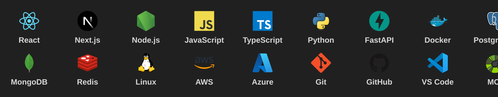

<!--
Sam Codex GitHub Profile
Keywords: Sam Codex, AI Automation Engineer, SaaS Builder, Open Source Contributor, AI developer dashboard, automation engineer, full stack developer, personal IDE, open source.
-->

  

  <h1>Sam Codex</h1>
  <h3>AI Automation Engineer | SaaS Builder | Open Source Contributor</h3>

  

   

  
  
  
  
  

 

  

## About Me

  

## Tech Stack

  

  
  
  
  
  
  

 

  

## Current Projects

<table width="100%">
  <tr>
    <td width="50%" valign="top">
      <h3>ultimate-rag-agent</h3>
      
Enterprise-grade Retrieval-Augmented Generation platform with AI agents, document intelligence, hybrid search, multi-tenant architecture, and multi-provider AI support.  
        
        

      
<code>Language not set</code> <code>Stars 0</code> <code>Forks 0</code>

      
    </td>
    <td width="50%" valign="top">
      <h3>Eternal-Chat</h3>
      
Privacy-first, end-to-end encrypted messaging platform with ephemeral conversations, self-destructing messages, zero unnecessary data retention, and secure cross-device communication.  
        
        

      
<code>Language not set</code> <code>Stars 0</code> <code>Forks 0</code>

      
    </td>
  </tr>
  <tr>
    <td width="50%" valign="top">
      <h3>couples-space</h3>
      
A private digital space for couples to chat, share memories, manage events, plan together, and strengthen relationships with secure communication and AI-powered features.  
        
        

      
<code>Language not set</code> <code>Stars 0</code> <code>Forks 0</code>

      
    </td>
    <td width="50%" valign="top">
      <h3>password-manager</h3>
      
A modern, self-hosted password manager built by customizing Vaultwarden with enhanced security, enterprise features, custom branding, monitoring, and automation capabilities.  
        
        

      
<code>Language not set</code> <code>Stars 0</code> <code>Forks 0</code>

      
    </td>
  </tr>
</table>

  

## Latest YouTube Videos

<!-- YOUTUBE-FEED:START -->
<table>
  <tr>
    <td width="20%" align="center"><strong>YouTube</strong></td>
    <td width="80%"><strong>Latest five videos sync every six hours.</strong> Thumbnail, title, published date, watch button, and optional view counts are generated by workflow.</td>
  </tr>
</table>
<!-- YOUTUBE-FEED:END -->

## Instagram

<!-- INSTAGRAM-FEED:START -->
<table>
  <tr>
    <td width="33%" align="center"><strong>Latest Posts</strong> Six curated thumbnails keep the profile visual and current.</td>
    <td width="33%" align="center"><strong>Audience profile</strong> Instagram followers</td>
    <td width="33%" align="center"><strong>Follow</strong> </td>
  </tr>
</table>
<!-- INSTAGRAM-FEED:END -->

## LinkedIn Dashboard

<!-- LINKEDIN-FEED:START -->
<table width="100%">
  <tr>
    <td colspan="3">
      
    </td>
  </tr>
  <tr>
    <td width="38%" valign="top">
      <h3>Sam Codex</h3>
      <strong>AI Automation Engineer</strong>
       
      SaaS Builder | Open Source Contributor
        
      
      
    </td>
    <td width="31%" valign="top">
      <strong>Activity</strong>
       
      Posts, launches, ideas, and engineering notes.
        
      
      
    </td>
    <td width="31%" valign="top">
      <strong>Experience</strong>
       
      
      
      
    </td>
  </tr>
  <tr>
    <td colspan="3">
      <strong>Skills</strong>
       
      
      
      
      
      
      
    </td>
  </tr>
</table>
<!-- LINKEDIN-FEED:END -->

## npm Packages

<!-- NPM-PACKAGES:START -->
<table>
  <tr>
    <td width="50%"><strong>npm Package Console</strong> Downloads, versions, descriptions, and repository links update daily from the npm registry.</td>
    <td width="50%"><strong>Release Surface</strong> Public packages appear as polished dashboard cards when package names are added to the registry config.</td>
  </tr>
</table>
<!-- NPM-PACKAGES:END -->

## Blog Feed

<!-- BLOG-FEED:START -->
<table>
  <tr>
    <td width="33%"><strong>DEV.to</strong> Latest engineering articles sync from RSS every day.</td>
    <td width="33%"><strong>Hashnode</strong> Long-form build notes and product thinking render as article cards.</td>
    <td width="33%"><strong>Medium</strong> Published essays and technical posts join the same dashboard feed.</td>
  </tr>
</table>
<!-- BLOG-FEED:END -->

## Support

<table>
  <tr>
    <td width="25%" align="center"><strong>Buy Me A Coffee</strong> Support independent AI automation work. </td>
    <td width="25%" align="center"><strong>GitHub Sponsors</strong> Back open-source tools and developer systems. </td>
    <td width="25%" align="center"><strong>PayPal</strong> One-time support for product and open-source work. </td>
    <td width="25%" align="center"><strong>UPI</strong> Fast local support for builders and contributors. </td>
  </tr>
</table>

## Connect

  
  
  
  
  
  
  
  
  
  
  

 

## Footer

  
   
  
   
  <strong>Build • Automate • Scale • Impact</strong>
   
  Copyright © 2026 Sam Codex. All rights reserved.
   
  <!-- LAST_UPDATED:START -->Last automated profile refresh: 2026-07-15 11:40 UTC.<!-- LAST_UPDATED:END -->

